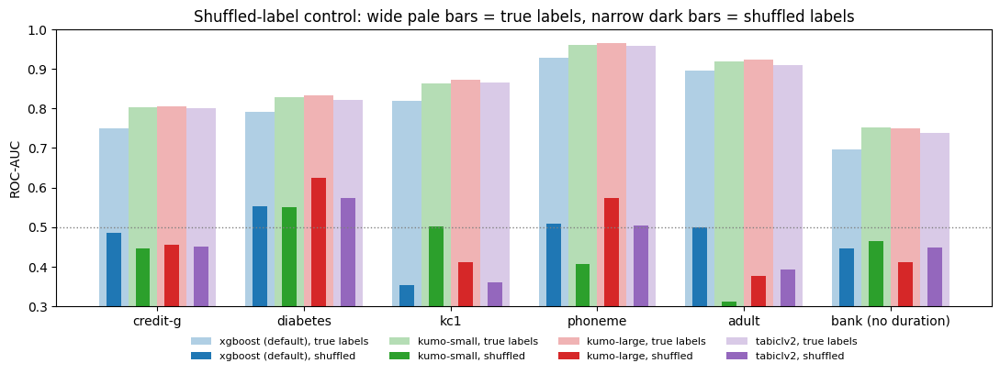
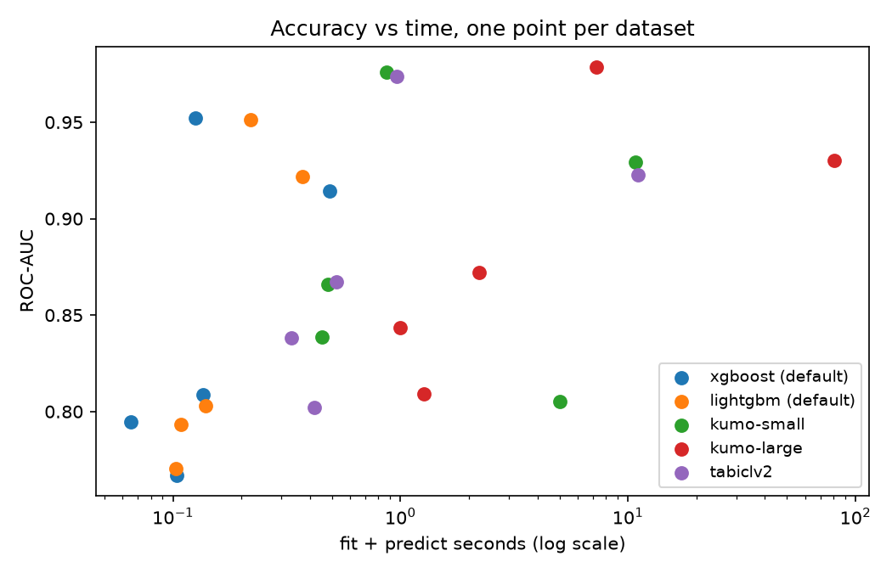

# Can a pretrained model beat XGBoost without training? NVIDIA Kumo Tabular vs gradient-boosted trees, plus a rematch with my 2020 Bank Marketing models

## TL;DR

- **With zero tuning, NVIDIA Kumo Tabular beat default XGBoost and LightGBM on 25 of 25 train/test splits** across five OpenML datasets, by +0.034 ROC-AUC on average. The two other in-context models, Kumo small and TabICLv2, also beat the GBDTs on nearly every split.
- **The advantage is largest with little data and shrinks as data grows.** On adult it was +0.05 ROC-AUC at 100 training rows and +0.01 at 10,000.
- **On Bank Marketing, the zero-tuning model edged out my hand-tuned 2020 models.** Kumo large had the best PR-AUC both with the leaky `duration` feature (0.566 vs 0.542 for tuned XGBoost) and without it (0.373 vs 0.349).
- **Rebuilding the 2020 models exposed a bug in the 2020 notebook.** Its random forest scores look inflated by train/test leakage from an unseeded shuffle combined with pickled models.
- **The cost is speed.** On a 10k-row table Kumo large took about 80 s on a T4 GPU, while XGBoost took 0.3 s on CPU. Kumo small was nearly as accurate at about 11 s.

## Question

With zero tuning, does a pretrained tabular foundation model ([NVIDIA Kumo Tabular](https://huggingface.co/blog/nvidia/kumo-tabular)) beat default XGBoost and LightGBM on small and medium classification tables? And how does it compare with the hand-tuned models from my [2020 Bank Marketing notebook](https://github.com/CJosh88/scriptz/blob/master/Bank%20Marketing%20ML.ipynb)?

## How in-context learning works

A gradient-boosted tree model is **trained**. You give it your training rows, it builds hundreds of trees to fit them, and you then use those trees to predict new rows. Every dataset gets its own freshly fitted model, usually with hyperparameter tuning on top.

Kumo Tabular is **never trained on your data**. Its weights were fixed once, by NVIDIA, after pretraining on tens of millions of *synthetic* tables. The tables were generated from random causal graphs, so the model has seen a huge variety of "features cause a target" patterns, but no real dataset. To make a prediction, you pass it two things in a single forward pass:

1. your labelled training rows (the **context**), and
2. the unlabelled rows you want predictions for (the **queries**).

Inside the transformer, each query row attends to the context rows and their labels and infers the relationship on the fly, much as an LLM picks up a task from worked examples in its prompt. Nothing is fitted, nothing is tuned and no weights change. The "learning" happens inside one forward pass, which is why it's called **in-context learning** (ICL).

| | XGBoost / LightGBM | Kumo Tabular (ICL) |
|---|---|---|
| Uses your training rows | to fit a new model | as context in a forward pass |
| Weights change? | yes, built from scratch per dataset | no, frozen after pretraining |
| Hyperparameter tuning | usually needed | none |
| What it learned beforehand | nothing | priors from ~35–137M synthetic tables |
| Compute | cheap CPU | GPU; cost grows with context size |
| Practical limit | none really | context size (here 10k rows per ensemble member) |

So this isn't zero-shot. The model needs labelled examples, and in every comparison here it gets exactly the same training rows as XGBoost and LightGBM. It's zero-*training*. The pretrained prior is what lets it do well from very few rows.

## Setup

| Part | What | Models |
|---|---|---|
| A | 5 OpenML-CC18 binary datasets × 5 stratified 75/25 splits (train capped at 10k rows, test at 5k) | XGBoost (default), LightGBM (default), TabICLv2, Kumo Tabular small (28M params) and large (215M) |
| Learning curve | adult and Bank Marketing (no `duration`), 100 to 10k training rows, 3 seeds | XGBoost, LightGBM, Kumo Tabular large |
| B | UCI Bank Marketing on the 2020 split (80/20, `random_state=20`) and 2020 encoding, with and without the leaky `duration` feature | The four 2020 models, rebuilt with the best hyperparameters the 2020 search found, plus all Part A models |
| Controls | Leak check for the 2020 numbers; shuffled-label check for the in-context models | as above |

- **No tuning anywhere** except the 2020 models, which keep their 2020 tuned settings. The GBDTs use library defaults with native categorical handling.
- **Kumo settings:** 8 ensemble members, fp16, at most 10k context rows per member. Larger training sets get a different random 10k subsample per member.
- **Metrics:** ROC-AUC, PR-AUC (average precision) and log loss. Threshold-0.5 accuracy, precision, recall and F1 are included to line up with the 2020 table. Timings cover fit plus predict.
- **Hardware:** Colab T4 GPU for the in-context models, Colab's 2 vCPUs for the trees.
- **Reproducibility:** a full rerun reproduced every Part A ROC-AUC to 4 decimal places.

Kumo Tabular and TabICLv2 come from NVIDIA's [`structured-data-models`](https://github.com/NVIDIA/structured-data-models) library (alpha), pinned to commit `ce95710`. It can't be installed from PyPI, because the PyPI name is an empty `0.0.0a0` placeholder, even though the Hugging Face model card says `pip install structured-data-models`. The code snippet in NVIDIA's blog post also has typos, so the notebook follows the repo's own examples instead.

## Results

### Part A: five OpenML datasets, 5 splits each

Mean ROC-AUC over 5 splits:

| Dataset | Rows | XGBoost | LightGBM | TabICLv2 | Kumo small | Kumo large |
|---|---|---|---|---|---|---|
| credit-g | 1,000 | 0.767 | 0.770 | 0.802 | 0.805 | **0.809** |
| diabetes | 768 | 0.794 | 0.803 | 0.838 | 0.839 | **0.843** |
| kc1 | 2,109 | 0.809 | 0.793 | 0.867 | 0.866 | **0.872** |
| phoneme | 5,404 | 0.952 | 0.951 | 0.974 | 0.976 | **0.979** |
| adult | 48,842 | 0.914 | 0.922 | 0.923 | 0.929 | **0.930** |
| **Mean rank** | | 4.52 | 4.44 | 2.72 | 2.24 | **1.08** |

- **Kumo large** beat the better of the two GBDTs on **25 of 25** splits, by +0.034 ROC-AUC on average. Its smallest margin was +0.007.
- **Kumo small** also won 25/25 (+0.030). **TabICLv2** won 24/25, with one tie (+0.028).
- **Size made little difference.** Kumo large beat Kumo small on 24/25 splits, but only by +0.004.
- **The gap was largest on the smaller tables** (kc1 +0.06, diabetes +0.04, credit-g +0.04) and smallest on adult (+0.008).
- **The in-context models were also better calibrated.** Default XGBoost's log loss was about 1.5× Kumo large's on credit-g (0.70 vs 0.47) and on diabetes (0.75 vs 0.46).

### Learning curve

Mean ROC-AUC over 3 seeds:

| Dataset | Training rows | XGBoost | LightGBM | Kumo large |
|---|---|---|---|---|
| adult | 100 | 0.807 | 0.740 | **0.859** |
| adult | 1,000 | 0.877 | 0.882 | **0.912** |
| adult | 10,000 | 0.911 | 0.917 | **0.927** |
| Bank Marketing (no `duration`) | 100 | 0.588 | 0.584 | **0.648** |
| Bank Marketing (no `duration`) | 1,000 | 0.653 | 0.662 | **0.720** |
| Bank Marketing (no `duration`) | 10,000 | 0.693 | 0.719 | **0.740** |

- **Kumo large led at every training size, and its lead shrank as data grew.** On adult it was +0.05 at 100 rows and +0.01 at 10,000.
- **It needed far fewer rows to match the trees.** On Bank Marketing, Kumo with 1,000 rows matched the best GBDT with 10,000 rows (0.720 vs 0.719). On adult it needed 3,000 rows (0.922 vs 0.917).

### Part B: Bank Marketing rematch (test set n = 9,043, 11.7% positive)

The 2020 notebook kept `duration` (call length). UCI warns against using it for a realistic model, because you only know it once the call is over. So Part B runs twice: once with the 2020 feature set (like for like) and once without `duration` (the honest task).

| Model | 2020 features: ROC-AUC | 2020 features: PR-AUC | No `duration`: ROC-AUC | No `duration`: PR-AUC |
|---|---|---|---|---|
| Logistic regression (2020) | 0.860 | 0.466 | 0.690 | 0.268 |
| Logistic regression + SMOTE (2020) | 0.864 | 0.468 | 0.691 | 0.269 |
| Random forest + SMOTE (2020) | 0.885 | 0.492 | 0.715 | 0.310 |
| XGBoost, tuned and cost-sensitive (2020) | 0.895 | 0.542 | 0.733 | 0.349 |
| XGBoost (default) | 0.888 | 0.508 | 0.722 | 0.331 |
| LightGBM (default) | 0.897 | 0.540 | **0.740** | 0.351 |
| TabICLv2 | 0.898 | 0.551 | 0.737 | 0.344 |
| Kumo small | 0.900 | 0.564 | 0.737 | 0.356 |
| Kumo large | **0.901** | **0.566** | 0.739 | **0.373** |

- **Kumo large had the highest PR-AUC in both variants, with zero tuning.** It beat the 2020 XGBoost, which took about 8 minutes of random search, by +0.024 in both variants. Without `duration`, ROC-AUC is effectively a tie with default LightGBM (0.739 vs 0.740).
- **`duration` was doing most of the work.** Removing it cost every model 0.16–0.17 ROC-AUC, so much of the 2020 notebook's apparent skill came from a feature that isn't available at prediction time.
- **At a 0.5 threshold the picture differs.** Kumo large with `duration` gets precision 0.64, recall 0.40 and F1 0.49. The 2020 random forest (SMOTE) gets 0.44, 0.71 and 0.54. Nothing tells the in-context models about the 88/12 class imbalance, so they predict "yes" conservatively, whereas SMOTE and `scale_pos_weight` deliberately trade precision for recall. Choosing a threshold from the precision-recall curve closes that gap, and the curves below show Kumo on or above the other models for most of the recall range.

### The 2020 numbers don't reproduce, and why

Rebuilt with the same split, encoding and tuned hyperparameters, the 2020 logistic regressions match what the 2020 notebook printed. The random forest and XGBoost don't:

| F1 at threshold 0.5 | Printed in 2020 | Rebuilt today |
|---|---|---|
| Logistic regression | 0.30 | 0.33 |
| Logistic regression + SMOTE | 0.47 | 0.47 |
| Random forest + SMOTE | **0.65** | **0.54** |
| XGBoost | **0.64** | **0.51** |

The 2020 notebook shuffled the data **without a seed** and evaluated models **loaded from `.pkl` files**. If those pickles were trained in an earlier session, that session had a different shuffle. A large share of the 2020 "test" rows would then have been training rows for the pickled models.

Simulating exactly that (train on one shuffle's split, score on another shuffle's test split):

| Model | F1, clean test | F1, reshuffled test | Printed in 2020 |
|---|---|---|---|
| Logistic regression | 0.32 | 0.33 | 0.30 |
| Logistic regression + SMOTE | 0.49 | 0.49 | 0.47 |
| Random forest + SMOTE | 0.54 | **0.68** | **0.65** |
| XGBoost | 0.53 | 0.55 | 0.64 |

- **Random forest:** the leak reproduces its 2020 numbers almost exactly (precision 0.56 vs 0.54, recall 0.86 vs 0.84). A depth-16 forest memorises its training rows, so leaked rows inflate its score.
- **Logistic regression:** unaffected, as you'd expect from a model that can't memorise.
- **XGBoost:** the leak explains only a small part of its gap. The rest is unexplained; library-version differences are one candidate.

The likely conclusion is that my 2020 random forest was never as good as the notebook reported.

### Leakage control: shuffled labels

All six datasets are well-known public benchmarks. Kumo Tabular is reportedly pretrained only on synthetic tables, but a fair question is whether its edge comes from having effectively "seen" these datasets before.

To test that, each model got the same training rows with **randomly permuted labels**: same class balance, no real relationship to the features. Up to 3,000 training rows and 2,000 test rows were used, with 3 permutations per dataset. A model that learns from its context should fall to chance (ROC-AUC ≈ 0.5). One that recognises the dataset would keep scoring well.

| Model | Mean ROC-AUC, true labels | Mean ROC-AUC, shuffled labels |
|---|---|---|
| Kumo large | 0.858 | 0.475 |
| Kumo small | 0.855 | 0.446 |
| TabICLv2 | 0.849 | 0.455 |
| XGBoost (default) | 0.814 | 0.474 |

- **Every model collapsed to chance or below**, and the in-context models collapsed as fully as XGBoost, which can't have memorised anything.
- **Individual runs are noisy** (0.25–0.66), XGBoost included. Diabetes was above 0.5 for all four models, XGBoost too, so that's a property of the dataset and the small sample rather than recall.
- **No sign of memorisation.** The performance comes from the labelled rows in context.

### Cost

Median fit-plus-predict time per split:

| Dataset | XGBoost (CPU) | LightGBM (CPU) | TabICLv2 (T4) | Kumo small (T4) | Kumo large (T4) |
|---|---|---|---|---|---|
| credit-g (750 train / 250 test) | 0.09 s | 0.06 s | 0.39 s | 0.55 s | 1.2 s |
| phoneme (4k / 1.4k) | 0.12 s | 0.12 s | 0.97 s | 0.85 s | 7.3 s |
| adult (10k / 5k) | 0.31 s | 0.20 s | 11.0 s | 10.6 s | 80.7 s |

On adult, Kumo large was about 250× slower than XGBoost and Kumo small about 35× slower. Kumo small gave up only 0.004 ROC-AUC on average for an 8× speed-up over large, so on this evidence it's the better default.

## Conclusions

1. **For small and medium tables, a pretrained in-context model is now a strong default.** With no tuning, Kumo Tabular beat untuned GBDTs on every split tested, often by a margin bigger than the split-to-split noise. On Bank Marketing it also beat my tuned 2020 XGBoost on PR-AUC.
2. **The less data you have, the bigger the win.** Kumo needed roughly 3–10× fewer rows than the trees to reach the same ROC-AUC. As data grows towards the context limit, the GBDTs close in.
3. **Kumo small is the practical choice.** It came within 0.004 ROC-AUC of large at about one-eighth of the cost.
4. **Thresholds still need thought.** The in-context models aren't told about class imbalance, so on imbalanced problems pick the operating point from the precision-recall curve rather than using 0.5.
5. **The rematch was most useful for checking my old work.** It surfaced a leaky feature (`duration`) and a train/test leak that likely inflated my 2020 random forest results.

## Limitations

- **Small benchmark.** Five binary datasets and one extra case study. NVIDIA's claims rest on TabArena's 51 datasets. These results are a sanity check on public data, not a ranking.
- **Untuned baselines.** Except for the 2020 models, the GBDTs ran at library defaults with no early stopping. Tuned GBDTs would close some of the gap.
- **Context cap.** Kumo saw at most 10k training rows per ensemble member, and used 8 members rather than the 16 in NVIDIA's benchmark. Larger GPUs would allow more of both.
- **Public datasets.** The shuffled-label control rules out memorisation of these datasets, but it can't rule out that the model's design was tuned on public benchmarks like these. A dataset published after the model, or private data, would be a stronger test.
- **Timing compares a GPU with a 2-vCPU CPU.** It reflects practical cost on free Colab, not algorithmic efficiency.
- **Fine-tuning not tested.** NVIDIA's library supports fine-tuning Kumo on your own data, but every Kumo number here is from the frozen pretrained model.

## Data

| Dataset | Source | Rows | Licence |
|---|---|---|---|
| credit-g | [OpenML 31](https://www.openml.org/d/31) | 1,000 | Public |
| diabetes | [OpenML 37](https://www.openml.org/d/37) | 768 | Public |
| kc1 | [OpenML 1067](https://www.openml.org/d/1067) | 2,109 | Public |
| phoneme | [OpenML 1489](https://www.openml.org/d/1489) | 5,404 | Public |
| adult | [OpenML 1590](https://www.openml.org/d/1590) | 48,842 | Public |
| Bank Marketing (`bank-full.csv`) | [UCI 222](https://archive.ics.uci.edu/dataset/222/bank+marketing) | 45,211 | CC BY 4.0 |

Bank Marketing citation: S. Moro, P. Cortez and P. Rita (2014), *A Data-Driven Approach to Predict the Success of Bank Telemarketing*, Decision Support Systems 62:22–31.

## How to run

1. Click the Colab badge and pick **Runtime → Change runtime type → T4 GPU**.
2. Run all cells. The first cell installs the pinned packages. Kumo weights (about 1 GB for small and large) download from Hugging Face on first use; no token is needed.
3. Optional: set `QUICK = True` in the Config cell for a few-minute pipeline check, and `USE_DRIVE = True` to keep the result cache across Colab sessions.

Locally: Python 3.11+, a CUDA GPU, `pip install -r requirements.txt`, then run `notebook.ipynb`.

Results are cached as they're computed, so a disconnect only loses the run in progress.

## Files

- [`notebook.ipynb`](notebook.ipynb): the full experiment.
- [`results_openml.csv`](results_openml.csv), [`summary_openml.csv`](summary_openml.csv): Part A, per split and averaged.
- [`results_learning_curve.csv`](results_learning_curve.csv): the learning curve.
- [`results_bank.csv`](results_bank.csv): Part B, all metrics.
- [`summary_shuffled_labels.csv`](summary_shuffled_labels.csv): shuffled-label control, mean and max over 3 permutations. It was rebuilt from the notebook's printed output, because the runtime disconnected before the raw CSV was saved.
- [`figures/`](figures): all charts.
