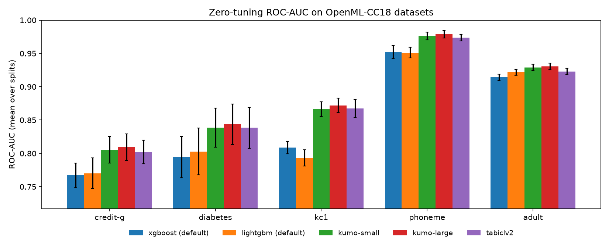
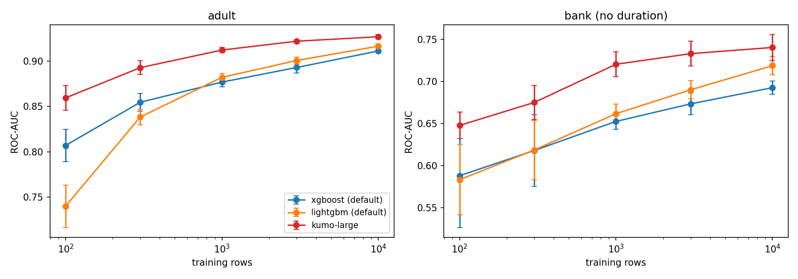
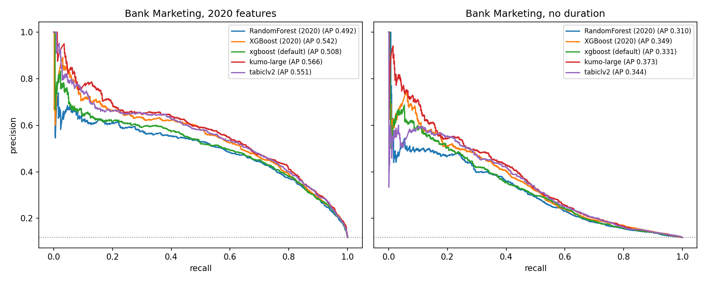

# NVIDIA Kumo Tabular vs gradient-boosted trees, plus a Bank Marketing rematch

## Question

With zero tuning, does a pretrained tabular foundation model ([NVIDIA Kumo Tabular](https://huggingface.co/blog/nvidia/kumo-tabular)) beat default XGBoost and LightGBM on small and medium classification tables? And how does it compare with the hand-tuned models from my [2020 Bank Marketing notebook](https://github.com/CJosh88/scriptz/blob/master/Bank%20Marketing%20ML.ipynb)?

## Setup

| Part | What | Models |
|---|---|---|
| A | 5 OpenML-CC18 binary datasets × 5 stratified splits (train capped at 10k rows) | XGBoost (default), LightGBM (default), TabICLv2, Kumo Tabular small and large |
| Learning curve | adult and Bank Marketing (no `duration`), 100 to 10k training rows, 3 seeds | XGBoost, LightGBM, Kumo Tabular large |
| B | UCI Bank Marketing on the 2020 split and encoding, with and without the leaky `duration` feature | The four 2020 models (logistic regression ± SMOTE, random forest + SMOTE, cost-sensitive XGBoost), rebuilt with their 2020 best hyperparameters, plus all Part A models |

Metrics: ROC-AUC, PR-AUC, log loss, and threshold-0.5 accuracy, precision, recall and F1 (to line up with the 2020 table), plus fit and predict time.

Kumo Tabular and TabICLv2 come from NVIDIA's [`structured-data-models`](https://github.com/NVIDIA/structured-data-models) library (alpha), pinned to commit `ce95710`. It is not installable from PyPI: the PyPI name is an empty placeholder.

## Data

| Dataset | Source | Rows | Licence |
|---|---|---|---|
| credit-g | [OpenML 31](https://www.openml.org/d/31) | 1,000 | Public |
| diabetes | [OpenML 37](https://www.openml.org/d/37) | 768 | Public |
| kc1 | [OpenML 1067](https://www.openml.org/d/1067) | 2,109 | Public |
| phoneme | [OpenML 1489](https://www.openml.org/d/1489) | 5,404 | Public |
| adult | [OpenML 1590](https://www.openml.org/d/1590) | 48,842 | Public |
| Bank Marketing (`bank-full.csv`) | [UCI 222](https://archive.ics.uci.edu/dataset/222/bank+marketing) | 45,211 | CC BY 4.0 |

Bank Marketing citation: S. Moro, P. Cortez and P. Rita (2014), *A Data-Driven Approach to Predict the Success of Bank Telemarketing*, Decision Support Systems 62:22–31.

## How to run

1. Click the Colab badge and pick **Runtime → Change runtime type → T4 GPU**.
2. Run all cells. The first cell installs the pinned packages. Kumo weights (about 1 GB for small and large) download from Hugging Face on first use; no token is needed.
3. Optional: set `QUICK = True` in the Config cell for a few-minute pipeline check, and `USE_DRIVE = True` to keep the result cache across Colab sessions.

Locally: Python 3.11+, a CUDA GPU, `pip install -r requirements.txt`, then run `notebook.ipynb`.

The full run time on a T4 hasn't been measured yet. Every result is cached as soon as it is computed, so a disconnect only loses the run in progress.

## Results

From the full run on a Colab T4 GPU (`QUICK = False`, 8 ensemble members, context capped at 10k rows). Raw numbers: [`results_openml.csv`](results_openml.csv), [`summary_openml.csv`](summary_openml.csv), [`results_learning_curve.csv`](results_learning_curve.csv), [`results_bank.csv`](results_bank.csv).

### Part A: five OpenML datasets, 5 splits each

Mean ROC-AUC over 5 splits:

| Dataset | XGBoost | LightGBM | TabICLv2 | Kumo small | Kumo large |
|---|---|---|---|---|---|
| credit-g | 0.767 | 0.770 | 0.802 | 0.805 | **0.809** |
| diabetes | 0.794 | 0.803 | 0.838 | 0.839 | **0.843** |
| kc1 | 0.809 | 0.793 | 0.867 | 0.866 | **0.872** |
| phoneme | 0.952 | 0.951 | 0.974 | 0.976 | **0.979** |
| adult | 0.914 | 0.922 | 0.923 | 0.929 | **0.930** |
| **Mean rank** | 4.52 | 4.44 | 2.72 | 2.24 | **1.08** |

- Kumo large beat the better of the two default GBDTs on **25 of 25** splits, by +0.034 ROC-AUC on average (smallest margin +0.007). Kumo small also won 25/25 (+0.030); TabICLv2 won 24/25 with one tie (+0.028).
- Kumo large beat Kumo small on 24/25 splits, but only by +0.004 on average.
- Default XGBoost's log loss was about 1.5× Kumo large's on credit-g (0.70 vs 0.47) and diabetes (0.75 vs 0.46).
- Median fit + predict time per split on adult (10k training rows, 5k test rows): XGBoost 0.3s, LightGBM 0.2s (CPU); Kumo small 10.6s, TabICLv2 11.0s, Kumo large 80.7s (T4). On the four small datasets every model took under 8s.

### Learning curve

Mean ROC-AUC over 3 seeds:

| Dataset | Training rows | XGBoost | LightGBM | Kumo large |
|---|---|---|---|---|
| adult | 100 | 0.807 | 0.740 | **0.859** |
| adult | 1,000 | 0.877 | 0.882 | **0.912** |
| adult | 10,000 | 0.911 | 0.917 | **0.927** |
| Bank Marketing (no `duration`) | 100 | 0.588 | 0.584 | **0.648** |
| Bank Marketing (no `duration`) | 1,000 | 0.653 | 0.662 | **0.720** |
| Bank Marketing (no `duration`) | 10,000 | 0.693 | 0.719 | **0.740** |

Kumo large led at every training size, and its lead shrank as the training set grew (adult: +0.05 over the better GBDT at 100 rows, +0.01 at 10,000). On Bank Marketing, Kumo large with 1,000 rows matched the best GBDT with 10,000 rows (0.720 vs 0.719); on adult it needed 3,000 rows to do so (0.922 vs 0.917).

### Part B: Bank Marketing rematch (test set n = 9,043)

| Model | 2020 features: ROC-AUC | 2020 features: PR-AUC | No `duration`: ROC-AUC | No `duration`: PR-AUC |
|---|---|---|---|---|
| Logistic regression (2020) | 0.860 | 0.466 | 0.690 | 0.268 |
| Logistic regression + SMOTE (2020) | 0.864 | 0.468 | 0.691 | 0.269 |
| Random forest + SMOTE (2020) | 0.885 | 0.492 | 0.715 | 0.310 |
| XGBoost, tuned (2020) | 0.895 | 0.542 | 0.733 | 0.349 |
| XGBoost (default) | 0.888 | 0.508 | 0.722 | 0.331 |
| LightGBM (default) | 0.897 | 0.540 | **0.740** | 0.351 |
| TabICLv2 | 0.898 | 0.551 | 0.737 | 0.344 |
| Kumo small | 0.900 | 0.564 | 0.737 | 0.356 |
| Kumo large | **0.901** | **0.566** | 0.739 | **0.373** |

- Zero-tuning Kumo large had the highest PR-AUC in both variants, ahead of the 2020 tuned XGBoost (0.566 vs 0.542, then 0.373 vs 0.349).
- Removing `duration` cost every model 0.16–0.17 ROC-AUC.
- At a 0.5 threshold the in-context models have low recall (Kumo large: 0.40 with `duration`, 0.13 without) because nothing corrects them for the 88/12 class imbalance. The SMOTE and cost-sensitive 2020 models trade precision for recall. See `results_bank.csv` for threshold-0.5 accuracy, precision, recall and F1.
- The rebuilt 2020 logistic regressions match the 2020 notebook's printed scores, but the rebuilt random forest and XGBoost score lower than 2020 printed (F1 0.54 vs 0.65 and 0.51 vs 0.64). The notebook's leak-check section tests one likely cause: the 2020 notebook shuffled without a seed and evaluated pickled models.

### Shuffled-label control

TODO: added after this run; rerun the notebook (other results are cached) to fill in.

### Interpretation

TODO(you).
